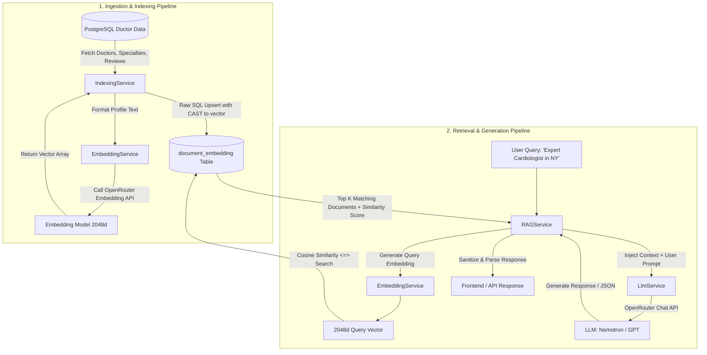

# Retrieval-Augmented Generation (RAG) Documentation & Implementation Guide

This document provides a comprehensive reference, architecture breakdown, and implementation guide for the RAG (Retrieval-Augmented Generation) system implemented in the **HealthCare-Server** backend.

---

## 📖 Table of Contents
1. [Overview & Motivation](#1-overview--motivation)
2. [Architecture & Workflow](#2-architecture--workflow)
3. [Database & Vector Store (pgvector + Prisma)](#3-database--vector-store-pgvector--prisma)
4. [Environment & Model Configuration](#4-environment--model-configuration)
5. [Codebase Structure & Component Breakdown](#5-codebase-structure--component-breakdown)
6. [API Endpoints Reference](#6-api-endpoints-reference)
7. [Step-by-Step Guide: Adding New Entities to RAG](#7-step-by-step-guide-adding-new-entities-to-rag)
8. [Summary of Completed Work](#8-summary-of-completed-work)
9. [Troubleshooting & Best Practices](#9-troubleshooting--best-practices)

---

## 1. Overview & Motivation

### What is RAG?
Retrieval-Augmented Generation (RAG) is an AI architecture that enhances Large Language Models (LLMs) by retrieving relevant facts and context from a custom vector database before generating an answer.

### Why RAG in Healthcare Management?
- **Intelligent Doctor Matching**: Enables patients to search for doctors using natural language (e.g., *"I have acute lower back pain and need an experienced specialist"*).
- **Up-to-date Dynamic Data**: LLMs lack private database knowledge. RAG pulls real-time doctor profiles, specialties, appointment fees, ratings, and patient reviews.
- **Structured JSON Output**: Converts complex semantic queries into structured JSON recommendations for direct frontend consumption.
- **Zero Hallucinations on Specific Entities**: Grounds answers strictly on retrieved doctor data stored in PostgreSQL.

---

## 2. Architecture & Workflow

### RAG Pipeline Overview



---

## 3. Database & Vector Store (pgvector + Prisma)

### 3.1 PostgreSQL Extension
The vector storage relies on PostgreSQL's `pgvector` extension:
```sql
CREATE EXTENSION IF NOT EXISTS vector;
```

### 3.2 Prisma Schema (`prisma/schema/rag.prisma`)
The `DocumentEmbedding` model stores document chunks, metadata, and 2048-dimensional vectors:

```prisma
model DocumentEmbedding {
    id          String    @id @default(uuid(7))
    chunkKey    String    @unique
    sourceType  String
    sourceId    String
    sourceLevel String?
    content     String
    metadata    Json? 

    embedding   Unsupported("vector(2048)")

    isDeleted   Boolean   @default(false)
    deletedAt   DateTime?
    createdAt   DateTime  @default(now())
    updatedAt   DateTime  @updatedAt

    @@index([sourceType], name:"idx_document_embedding_sourceType")
    @@index([sourceId], name:"idx_document_embedding_sourceId")
    @@map("document_embedding")
}
```

### 3.3 Raw SQL Vector Queries in Prisma
Because Prisma does not natively support vector operations in standard query builders, raw queries (`$executeRaw` / `$queryRaw`) with `Prisma.sql` are used:

- **Vector Upsert (`INSERT ... ON CONFLICT`)**:
  ```typescript
  const vectorLiteral = `[${vector.join(",")}]`;

  await prisma.$executeRaw(Prisma.sql`
    INSERT INTO "document_embedding"
    ("id", "chunkKey", "sourceType", "sourceId", "sourceLevel", "content", "metadata", "embedding", "updatedAt")
    VALUES
    (${Prisma.raw("gen_random_uuid()")}, ${chunkKey}, ${sourceType}, ${sourceId}, ${sourceLevel}, ${content}, ${JSON.stringify(metadata)}::jsonb, CAST(${vectorLiteral} AS vector), NOW())
    ON CONFLICT ("chunkKey")
    DO UPDATE SET
      "content" = EXCLUDED."content",
      "metadata" = EXCLUDED."metadata",
      "embedding" = EXCLUDED."embedding",
      "isDeleted" = false,
      "deletedAt" = null,
      "updatedAt" = NOW()
  `);
  ```

- **Cosine Similarity Search**:
  ```typescript
  const results = await prisma.$queryRaw(Prisma.sql`
    SELECT id, "chunkKey", "sourceType", "sourceId", "sourceLevel", content, metadata,
           1 - (embedding <=> CAST(${vectorLiteral} AS vector)) as similarity
    FROM "document_embedding"
    WHERE "isDeleted" = false
    ${sourceType ? Prisma.sql`AND "sourceType" = ${sourceType}` : Prisma.empty}
    ORDER BY embedding <=> CAST(${vectorLiteral} AS vector)
    LIMIT ${limit}
  `);
  ```

> **Note on Operator `<=>`**: In `pgvector`, `<=>` computes Cosine Distance ($0$ means identical, $2$ means opposite). Similarity score is computed as `1 - (embedding <=> queryVector)`.

---

## 4. Environment & Model Configuration

### 4.1 `.env` Variables
```env
OPENROUTER_API_KEY="your-openrouter-api-key"
OPENROUTER_EMBEDDING_MODEL="nvidia/nemotron-3-embed-1b:free"
OPENROUTER_LLM_MODEL="nvidia/nemotron-3-super-120b-a12b:free"
```

### 4.2 Configuration Loading (`src/config/env.ts`)
```typescript
RAG: {
    OPENROUTER_API_KEY: process.env.OPENROUTER_API_KEY as string,
    OPENROUTER_EMBEDDING_MODEL: process.env.OPENROUTER_EMBEDDING_MODEL as string,
    OPENROUTER_LLM_MODEL: process.env.OPENROUTER_LLM_MODEL as string,
}
```

---

## 5. Codebase Structure & Component Breakdown

All RAG logic is isolated under `src/app/module/rag/`:

```
src/app/module/rag/
├── embeddingService.ts   # Handles OpenRouter Embedding API calls (vector generation)
├── indexingService.ts    # Extracts DB records, constructs chunks, and upserts embeddings
├── llm.service.ts        # Handles OpenRouter Chat Completion API calls & prompt assembly
├── rag.service.ts        # Orchestrator coordinating retrieval, ranking, and generation
├── rag.controller.ts     # Express controller handling incoming HTTP requests
└── rag.route.ts          # Express route definitions for /api/v1/rag/*
```

### 5.1 `EmbeddingService` (`embeddingService.ts`)
- **Responsibility**: Communicates with `https://openrouter.ai/api/v1/embeddings`.
- **Method**: `generateEmbeddings(text: string): Promise<number[]>`
- **Vector Output**: Returns a 2048-dimensional float array (`number[]`).

### 5.2 `IndexingService` (`indexingService.ts`)
- **Responsibility**: Ingests relational entities into vector format.
- **Methods**:
  - `indexDocument(...)`: Low-level upsert of a single chunk into `document_embedding`.
  - `indexDoctorData()`: Fetches doctors with their associated `specialties` and `reviews`, compiles structured textual summaries, and indexes each doctor under `chunkKey = "doctor-${doctor.id}"`.

### 5.3 `LlmService` (`llm.service.ts`)
- **Responsibility**: Manages chat completion with prompt engineering and formatting.
- **Method**: `generateResponse(prompt: string, context: string[], asJson: boolean)`
- **Features**:
  - Automatically incorporates retrieved context docs.
  - Formats instructions for strict JSON responses when `asJson = true`.
  - Sets temperature to `0.1` for deterministic structured extraction.

### 5.4 `RAGService` (`rag.service.ts`)
- **Responsibility**: Core pipeline orchestrator.
- **Methods**:
  - `ingestDoctorData()`: Delegates to `IndexingService`.
  - `retrieveReleventDocs(query, limit, sourceType)`: Generates query vector & executes pgvector similarity query.
  - `generateAnswer(query, limit, sourceType, asJson)`: Retrieves top-$k$ context, invokes LLM, strips any markdown formatting from JSON, and returns answers alongside source citations.
  - `getStats()`: Returns total indexed active documents and breakdown by `sourceType`.

### 5.5 `RagController` & `RagRoutes` (`rag.controller.ts` & `rag.route.ts`)
- Maps HTTP endpoints to service methods using Express `catchAsync` and standard `sendResponse`.

---

## 6. API Endpoints Reference

Base path: `/api/v1/rag` (registered in `src/app/routes/index.ts`).

### 6.1 Ingest Doctors
- **URL**: `POST /api/v1/rag/ingest-doctor`
- **Description**: Re-indexes all active doctors, their specialties, and reviews into the vector database.
- **Response**:
  ```json
  {
    "success": true,
    "httpStatusCode": 200,
    "message": "doctor data ingest successfuly",
    "data": {
      "success": true,
      "message": "Successfully indexed 12 doctors.",
      "indexCount": 12
    }
  }
  ```

### 6.2 Query RAG (Search / Recommend Doctors)
- **URL**: `POST /api/v1/rag/query`
- **Description**: Submits a natural language query to retrieve matching doctor profiles and generate AI recommendations.
- **Request Body**:
  ```json
  {
    "query": "I need a cardiologist with high ratings and more than 5 years of experience",
    "limit": 3,
    "sourceType": "DOCTOR"
  }
  ```
- **Response**:
  ```json
  {
    "success": true,
    "httpStatusCode": 200,
    "message": "Doctor data retrieved successfully",
    "data": {
      "answer": {
        "doctors": [
          {
            "name": "Dr. Sarah Jenkins",
            "reason": "Specializes in Cardiology with 8 years of experience and 4.9 average rating.",
            "specialty": "Cardiology"
          }
        ]
      },
      "sources": [
        {
          "id": "01944754-...",
          "chunkKey": "doctor-uuid",
          "sourceType": "DOCTOR",
          "sourceId": "doctor-uuid",
          "sourceLevel": "Dr. Sarah Jenkins",
          "content": "Doctor Name: Dr. Sarah Jenkins\nExperience: 8 years...",
          "similarity": 0.8742
        }
      ],
      "contextUsed": true
    }
  }
  ```

### 6.3 Get Vector Store Stats
- **URL**: `GET /api/v1/rag/stats`
- **Description**: Retrieves statistics about indexed documents.
- **Response**:
  ```json
  {
    "success": true,
    "httpStatusCode": 200,
    "message": "Rag stats retrive succuessfull",
    "data": {
      "totalActiveDocuments": 12,
      "sourceTypeBreakdown": {
        "DOCTOR": 12
      },
      "timestamp": "2026-09-07T16:25:00.000Z"
    }
  }
  ```

---

## 7. Step-by-Step Guide: Adding New Entities to RAG

You can easily extend this RAG framework to index other entities (e.g. **Specialties**, **Hospitals**, **Medical FAQs**, or **Articles**).

### Step 1: Add Ingestion Method in `IndexingService`
In `src/app/module/rag/indexingService.ts`, define a new ingestion method:

```typescript
async indexSpecialtiesData() {
    const specialties = await prisma.specialties.findMany();
    let indexCount = 0;

    for (const spec of specialties) {
        const content = `Specialty: ${spec.title}\nDescription: ${spec.description || "General healthcare specialty"}`;
        const metadata = { specialtyId: spec.id, title: spec.title };
        const chunkKey = `specialty-${spec.id}`;

        await this.indexDocument(
            chunkKey,
            "SPECIALTY",      // New sourceType
            spec.id,
            spec.title,
            content,
            metadata
        );
        indexCount++;
    }
    return { success: true, indexCount };
}
```

### Step 2: Expose Ingestion in `RAGService`
In `src/app/module/rag/rag.service.ts`:
```typescript
async ingestSpecialtiesData() {
    return this.indexingService.indexSpecialtiesData();
}
```

### Step 3: Add Controller & Route
- In `rag.controller.ts`:
  ```typescript
  const ingestSpecialties = catchAsync(async (req: Request, res: Response) => {
      const result = await RagService.ingestSpecialtiesData();
      sendResponse(res, {
          httpStatusCode: 200,
          success: true,
          message: "Specialties indexed successfully",
          data: result,
      });
  });
  ```
- In `rag.route.ts`:
  ```typescript
  router.post("/ingest-specialties", RagController.ingestSpecialties);
  ```

### Step 4: Query by `sourceType`
Pass `sourceType: "SPECIALTY"` in the `POST /api/v1/rag/query` request body to isolate similarity searches to that document category.

---

## 8. Summary of Completed Work

| Feature / Component | Status | Details |
| :--- | :---: | :--- |
| **Prisma Schema (`rag.prisma`)** | ✅ Completed | `DocumentEmbedding` model with 2048-dim vector column, indexing, and metadata. |
| **OpenRouter Embedding Service** | ✅ Completed | Integration with `nvidia/nemotron-3-embed-1b:free` returning 2048d embeddings. |
| **pgvector Raw SQL Integration** | ✅ Completed | `$executeRaw` for upserting embeddings and `$queryRaw` for cosine similarity (`<=>`). |
| **Doctor Data Ingestion** | ✅ Completed | Ingests doctor profiles, associated specialties, and patient reviews into structured chunks. |
| **LLM Service & Context Injection** | ✅ Completed | System prompting, context framing, deterministic temperature (0.1), and JSON output support. |
| **RAG Orchestrator (`rag.service.ts`)** | ✅ Completed | Ingestion flow, vector retrieval with similarity scores, context building, and stats. |
| **Controllers & Routes** | ✅ Completed | `/stats`, `/ingest-doctor`, `/query` endpoints hooked into main Express router. |
| **Environment Variable Management** | ✅ Completed | Validation and configuration for OpenRouter API keys & model names in `env.ts`. |

---

## 9. Troubleshooting & Best Practices

1. **Vector Dimension Mismatch (`vector(2048)`)**:
   - The PostgreSQL column is defined as `vector(2048)`.
   - Ensure whatever embedding model is configured in `OPENROUTER_EMBEDDING_MODEL` outputs **2048-dimensional vectors**. If you switch to models like `text-embedding-3-small` (1536 dims), you must update `rag.prisma` and run a migration.

2. **Cleaning Markdown in JSON Responses**:
   - LLMs occasionally wrap JSON responses in code fences (e.g. ```` ```json ... ``` ````).
   - `rag.service.ts` includes automatic string stripping before `JSON.parse()` to prevent crashes.

3. **Incremental vs Full Ingestion**:
   - The current `indexDoctorData` iterates over all doctors.
   - For real-time updates when a doctor profile or review is added/modified, call `indexingService.indexDocument(...)` inside the doctor update/create service.

4. **Soft Deletions & Filtering**:
   - Queries automatically filter by `"isDeleted" = false`. When soft-deleting a doctor, remember to set `"isDeleted" = true` on the corresponding `document_embedding` record.
